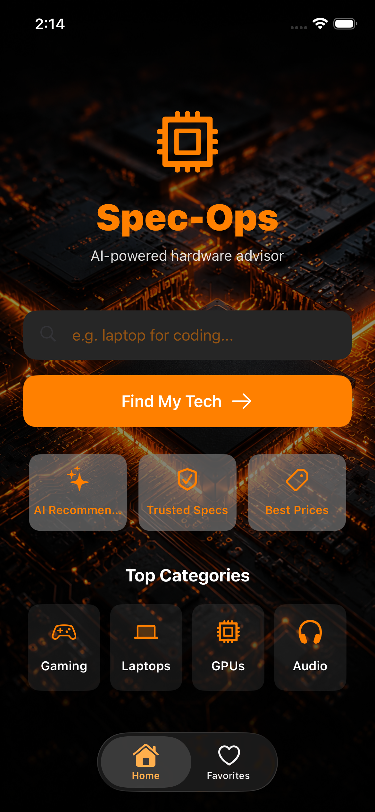
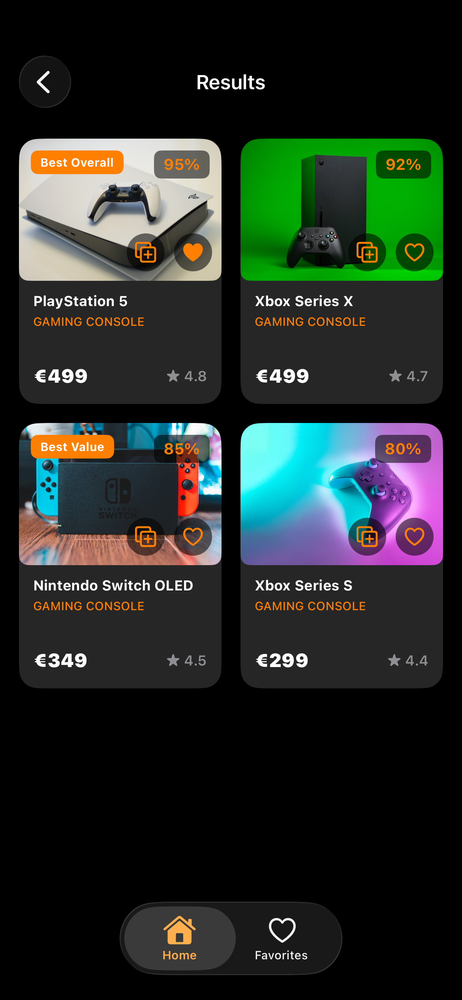
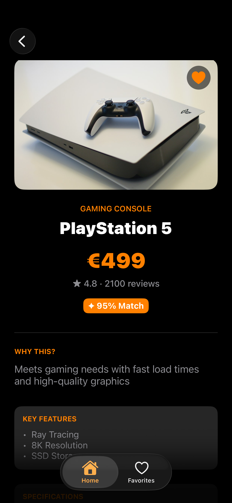
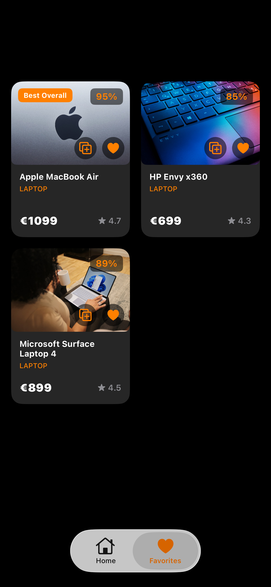
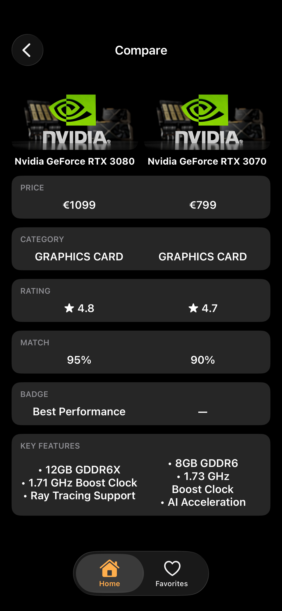

# Spec-Ops — AI-Powered Hardware Advisor

Spec-Ops is an iOS app that helps users find the right tech hardware through natural-language search. Describe what you need ("a laptop for coding", "best value GPU") and an AI model returns tailored product recommendations with ratings, match scores, key features, specs, and pros & cons. Users can favorite products for later and compare several side by side.

Built entirely in **UIKit, programmatically (no Storyboards)**, as a portfolio project focused on modern iOS patterns.

---

## Features

- **AI-powered search** — natural-language queries return structured product recommendations via the Groq API (Llama 3.3).
- **Rich product details** — each result includes rating, review count, AI match score, badges (Best Overall / Best Value / etc.), key features, specifications, and honest pros & cons.
- **Product images** — fetched dynamically from the Unsplash API with in-memory caching.
- **Favorites** — save products locally; persisted across launches with `UserDefaults` (Codable).
- **Compare** — select up to 3 products and view them side by side in a comparison table.
- **Curated home** — hero search, feature highlights, and tappable top categories.
- **Tab bar navigation** — Home and Favorites tabs, each with its own navigation stack.

---

## Screenshots

| Home | Results | Detail |
|------|---------|--------|
|  |  |  |

| Favorites | Compare |
|-----------|---------|
|  |  |

---

## Architecture & Tech

- **UIKit, 100% programmatic** — Auto Layout in code, no Storyboards or XIBs.
- **MVVM** — view models drive the results flow, keeping view controllers focused on UI.
- **Diffable Data Source + Compositional Layout** — for the multi-section Home and the results grid.
- **async/await** — modern Swift concurrency for all networking.
- **Codable** — for decoding API responses and persisting favorites.
- **Singletons for services** — `NetworkManager`, `ImageLoader`, `FavoritesManager`, `CompareManager`.
- **Unit tests** — with the Swift Testing framework.

### Project structure

```
Spec-Ops/
├── Apps/         AppDelegate, SceneDelegate
├── Model/        Product, ProductBadge, API request/response models
├── Service/      NetworkManager, ImageLoader, FavoritesManager,
│                 CompareManager, Secrets, Constants
├── View/         View controllers + custom cells/views
└── ViewModel/    ResultsViewModel
```

---

## Setup

This project uses two APIs. You need your own free API keys to run it.

### 1. Get API keys

- **Groq** (for AI recommendations) — create a free key at [console.groq.com](https://console.groq.com).
- **Unsplash** (for product images) — register an app at [unsplash.com/developers](https://unsplash.com/developers) and use the Access Key.

### 2. Add a `Secret.plist`

Create a file named **`Secret.plist`** in the `Spec-Ops/` source folder with this content, and add it to the app target:

```xml
<?xml version="1.0" encoding="UTF-8"?>
<!DOCTYPE plist PUBLIC "-//Apple//DTD PLIST 1.0//EN" "http://www.apple.com/DTDs/PropertyList-1.0.dtd">
<plist version="1.0">
<dict>
    <key>GROQ_API_KEY</key>
    <string>your_groq_key_here</string>
    <key>UNSPLASH_API_KEY</key>
    <string>your_unsplash_key_here</string>
</dict>
</plist>
```

> `Secret.plist` is listed in `.gitignore` and is never committed, so your keys stay private.

### 3. Build & run

Open `Spec-Ops.xcodeproj` in Xcode and run on a simulator or device (iOS 17+).

---

## Requirements

- Xcode 16+
- iOS 17+
- A Groq API key and an Unsplash API key (free)

---

## Author

**Dimitris Polyzos** — iOS Developer
[GitHub](https://github.com/dimitrispolyzos99) · [LinkedIn](https://www.linkedin.com/in/dimitris-polyzos-106373259)
