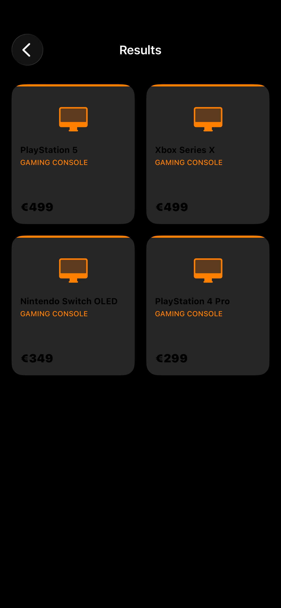

# Spec-Ops — AI-Powered Hardware Advisor

> *Tell me what you need. I'll find the right tech for you.*

---

## Screenshots

<p float="left">
  
  
  
</p>

---

## What is Spec-Ops?

Spec-Ops is a UIKit app that acts as your personal tech hardware advisor. You describe what you need in plain language — "laptop for video editing under €1500" — and the app uses an AI model to generate tailored product recommendations with European pricing, complete with product images pulled from Unsplash.

Built entirely in UIKit without Storyboards — all layouts are done programmatically using Auto Layout.

---

## Features

- **AI Recommendations** — powered by Groq (Llama 3.3 70B) to generate hardware suggestions based on natural language input
- **European Pricing** — all recommendations come with EUR pricing tailored for European customers
- **Product Images** — each product detail page fetches a relevant image from the Unsplash API
- **Programmatic UI** — zero Storyboards, all Auto Layout constraints written in code
- **UICollectionView** — grid layout built with `CompositionalLayout` and `DiffableDataSource`
- **MVVM Architecture** — `ResultsViewModel` handles all data fetching and state, keeping ViewControllers clean
- **Async/Await** — all network calls use modern Swift concurrency

---

## Tech Stack

| Area | Technology |
|---|---|
| UI | UIKit (programmatic, no Storyboards) |
| Architecture | MVVM |
| AI | Groq API (Llama 3.3 70B) |
| Images | Unsplash API |
| Networking | URLSession + async/await |
| Layout | Auto Layout + CompositionalLayout |
| Data | DiffableDataSource |

---

## Project Structure

```
Spec-Ops/
├── App/
│   ├── AppDelegate.swift
│   └── SceneDelegate.swift
├── Model/
│   ├── Product.swift
│   ├── OpenAIRequest.swift
│   └── UnsplashModels.swift
├── View/
│   ├── HomeViewController.swift
│   ├── ResultsViewController.swift
│   ├── DetailViewController.swift
│   └── ProductCollectionCell.swift
├── ViewModel/
│   └── ResultsViewModel.swift
└── Service/
    ├── NetworkManager.swift
    └── Constants.swift
```

---

## Architecture Decisions

**Why UIKit programmatically?**
Storyboards hide what's actually happening under the hood. Writing constraints in code forces you to understand how Auto Layout works — and makes the code easier to review, diff, and maintain in a team.

**Why MVVM in UIKit?**
`ResultsViewController` doesn't know how products are fetched — it just reacts to `onDataUpdated` and `onError` closures from `ResultsViewModel`. This separation makes the ViewController lightweight and the ViewModel independently testable.

**Why Groq?**
Groq runs Llama 3.3 70B with very fast inference — response times are noticeably quicker than alternatives, which matters for a recommendation flow where the user is waiting.

**Why DiffableDataSource?**
It handles cell updates with automatic diffing and smooth animations — no manual `reloadData()` calls or index path management.

---

## How It Works

1. User types a natural language query — e.g. "gaming laptop under €1200"
2. `NetworkManager` sends the query to the Groq API with a system prompt that enforces JSON output
3. The AI responds with a structured array of products (name, category, price, description)
4. `ResultsViewModel` parses the response and notifies the ViewController via closure
5. `DiffableDataSource` applies a snapshot and animates the cells in
6. Tapping a product pushes `DetailViewController`, which fetches a relevant image from Unsplash

---

## What I Learned Building This

- **Programmatic Auto Layout** — no Storyboards, every constraint written manually. After fighting with ambiguous constraints for a while, I now understand exactly how the layout engine resolves conflicts.
- **DiffableDataSource** — much cleaner than traditional DataSource. Once you understand snapshots, you never want to go back to `reloadData()`.
- **Prompting for structured output** — getting an LLM to return clean JSON every time requires a precise system prompt. Small wording changes have a big impact on reliability.
- **MVVM in UIKit with closures** — without `@Published` and `ObservableObject`, you wire ViewModels to ViewControllers manually via callbacks. It's more explicit — and actually clearer once you get used to it.

---

## Author

**Dimitris Polyzos** — Self-taught iOS Developer, Athens, Greece

- GitHub: [github.com/dimitrispolyzos99](https://github.com/dimitrispolyzos99)
- LinkedIn: [linkedin.com/in/dimitris-polyzos-106373259](https://linkedin.com/in/dimitris-polyzos-106373259)
